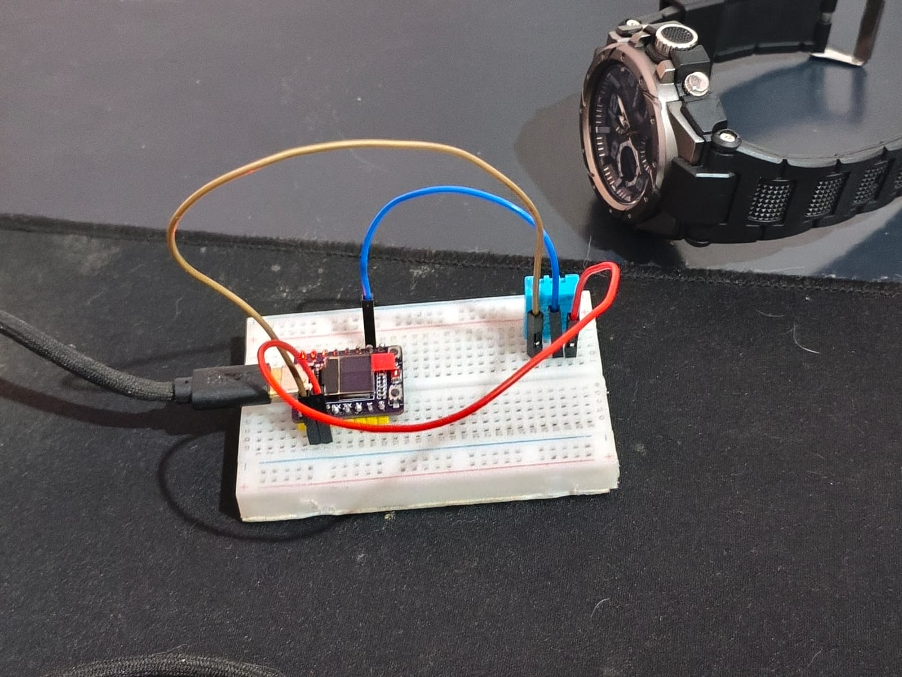

# PlantSync

**Sistema de telemetria de microclima para monitoramento da integridade de cargas na
cadeia de exportação de frutas do Vale do São Francisco**

Documento de acompanhamento — Checkpoint 01
Curso Superior de Tecnologia em Análise e Desenvolvimento de Sistemas — 4.º Período
Unidade Curricular Focal Integradora: Internet das Coisas

Petrolina, Pernambuco — Setembro de 2026

> A versão formatada para impressão e geração do PDF da entrega encontra-se em
> [`CHECKPOINT-01.html`](CHECKPOINT-01.html).

---

## 1 Identificação da equipe e contexto regional

### 1.1 Composição da equipe

A equipe é composta por cinco integrantes, organizados em três frentes técnicas conforme
apresentado na Tabela 1. A distribuição buscou alinhar as competências desenvolvidas nas
unidades curriculares do período às camadas da arquitetura proposta.

Tabela 1 – Composição da equipe e atribuições técnicas

| Integrante | Função técnica | Atribuição no período |
|---|---|---|
| Davi Clemente | Hardware e IoT | Especificação e homologação do microcontrolador, montagem do nó sensor e definição da pinagem. |
| Ygor Sampaio | Hardware e IoT | Montagem física, ensaios de sensoriamento e validação do invólucro do protótipo. |
| Jorge Antonio Figueredo | Backend e Cloud | Diagnóstico da camada de leitura do sensor e integração com a interface de ingestão. |
| Nicolas Tavares da Silva | Backend e Cloud | Configuração do canal de telemetria, definição do contrato REST e elaboração do memorial descritivo. |
| Pedro Valença | Frontend e Documentação | Camada de apresentação, governança documental e consolidação dos artefatos de entrega. |

Fonte: elaborado pelos autores (2026).

### 1.2 Contexto regional atendido

O projeto destina-se a produtores e exportadores de uva de mesa e manga do polo agrícola
de Petrolina, em Pernambuco, e Juazeiro, na Bahia. O nó sensor foi concebido para
operação em três pontos da cadeia pós-colheita: unidades de beneficiamento (*packing
houses*), câmaras de resfriamento rápido e compartimentos de carga refrigerada empregados
no transporte rodoviário até os portos de Suape e de Salvador.

O recorte adotado para o presente período concentra-se no elo de transporte, por
constituir o trecho da cadeia em que se verifica a menor disponibilidade de registros
sobre as condições reais a que a carga é submetida.

---

## 2 Status atual do projeto e checklist interdisciplinar

O levantamento a seguir registra a situação de cada item na data de elaboração deste
documento. Adota-se a seguinte convenção: `[X]` para item concluído, `[~]` para item
parcialmente concluído e `[ ]` para item não iniciado.

### 2.1 IoT e camada de borda (unidade curricular focal)

- `[X]` **Sensores definidos.** Adotou-se o sensor DHT11 em encapsulamento de quatro
  pinos, responsável pela aferição de temperatura e umidade relativa do ar, conectado ao
  GPIO 4 do microcontrolador, com resistor de pull-up de 10 kΩ entre a linha de dados e a
  alimentação de 3,3 V. As limitações metrológicas identificadas para este componente são
  discutidas na Seção 8.3.
- `[X]` **Microcontrolador homologado.** O ESP32-C3 foi validado por meio de ensaio
  isolado de comunicação serial a 115200 bauds, conduzido previamente à integração de
  qualquer sensor, o que permitiu confirmar o funcionamento da placa, do processo de
  gravação e do monitor serial.
- `[~]` **Payload serializado em JSON.** A ingestão em operação utiliza codificação em
  *query string* sobre HTTP, formato aceito pela interface do provedor de nuvem. A
  serialização em JSON estruturado e normalizado encontra-se implementada na segunda
  versão do firmware, mediante emprego da biblioteca ArduinoJson, ainda em fase de
  bancada.
- `[X]` **Testes de contrato via REST iniciados.** As requisições HTTP foram validadas
  com retorno de código de estado 200 e identificador de registro incremental fornecido
  pelo serviço de nuvem. Encontra-se versionada no repositório uma coleção de testes
  contendo cinco cenários.

### 2.2 Integração com nuvem e infraestrutura

- `[X]` **Provedor e serviços definidos.** Adotou-se a plataforma ThingSpeak como camada
  de ingestão primária e repositório de série temporal, com canal público criado e em
  operação.
- `[~]` **Estratégia de banco de dados modelada.** Definiu-se arquitetura de persistência
  em duas camadas: série temporal na plataforma de ingestão, destinada à telemetria
  bruta, e base relacional, destinada ao histórico consolidado. A modelagem física das
  entidades não foi elaborada até a presente data.

### 2.3 Ciência de dados e inteligência de safra

- `[ ]` **Fontes de dados climáticos históricos mapeadas.** Item não iniciado. Foram
  levantadas como fontes candidatas para o ciclo subsequente as estações meteorológicas
  do Instituto Nacional de Meteorologia situadas em Petrolina e as bases da Embrapa
  Semiárido.
- `[~]` **Scripts de limpeza e análise exploratória estruturados.** Encontra-se
  implementado e em execução um pipeline em linguagem Python, com emprego da biblioteca
  Pandas, que contempla auditoria de qualidade, tratamento de duplicatas e de valores
  atípicos, cálculo do indicador de abuso térmico acumulado, detecção de anomalias e
  classificação de risco do lote. A validação foi conduzida sobre série sintética,
  aguardando-se volume suficiente de telemetria real.

### 2.4 Segurança da informação e qualidade

- `[~]` **Política de controle de acesso e proteção de chaves de API.** A proteção de
  credenciais encontra-se implementada: as chaves residem em arquivo de cabeçalho local,
  excluído do controle de versão e distribuído à equipe sob a forma de arquivo-modelo sem
  valores reais. O controle de acesso baseado em papéis depende da camada de aplicação,
  ainda não iniciada.
- `[X]` **Estratégia de testes de firmware e de contrato em elaboração.** O padrão
  *Fail-Fast* encontra-se em operação no firmware, com validação em dois estágios. Os
  testes de contrato contemplam ingestão válida, ingestão em condição de alerta, rejeição
  de credencial inválida e leitura do canal.

### 2.5 Gestão e repositório

- `[X]` **Repositório oficial no GitHub configurado.** O repositório da equipe
  encontra-se ativo, com quatro contas colaboradoras e histórico de contribuições
  distribuído, organizado sob convenção de ramificação nominal por integrante. As frentes
  exploratórias são mantidas em repositórios satélites, relacionados na Seção 7.
- `[ ]` **Backlog de tarefas ou quadro Kanban ativo.** Item não iniciado. A coordenação
  foi conduzida até a presente data por canal de mensagens e divisão informal de frentes.
  A abertura de quadro formal constitui meta para o próximo checkpoint.

### 2.6 Estágio global da equipe

```
(  ) Planejamento e Arquitetura
(  ) Levantamento e Refinamento de Requisitos
(X ) Prototipagem da Borda (IoT)              <-- estágio predominante
(-> ) Integração Nuvem/Pipeline Inicial       <-- em transição
(  ) Desenvolvimento dos Dashboards e Modelos
(  ) Testes e Validação
```

A equipe concluiu o ciclo de prototipagem da camada de borda, dispondo de hardware
homologado, firmware funcional e telemetria efetivamente recebida pela plataforma de
nuvem. Inicia-se, no momento, a consolidação do pipeline de ingestão e o desenvolvimento
da camada analítica.

---

## 3 Problema regional e proposta de solução

### 3.1 Problema focal

A cadeia de exportação de frutas do Vale do São Francisco depende da manutenção de
condições térmicas restritas ao longo de todo o período pós-colheita, uma vez que desvios
de poucas horas são suficientes para comprometer a vida útil do produto e inviabilizar
sua comercialização nos mercados europeu e norte-americano. Entre a expedição na unidade
de beneficiamento e o embarque portuário, contudo, não há registro sistemático das
condições internas do compartimento de carga. Eventuais elevações de temperatura,
ocorrências de condensação sobre o produto ou aberturas indevidas do compartimento
permanecem sem documentação, o que impede a identificação do trecho em que a perda de
qualidade teve origem. A constatação do dano ocorre somente no destino, semanas após o
embarque, quando não é mais possível atribuir responsabilidade, corrigir o processo ou
fundamentar tratativas comerciais junto ao transportador.

### 3.2 Solução proposta

A solução consiste na instalação de um nó sensor de baixo custo no interior do
compartimento de carga. O microcontrolador ESP32-C3 realiza a aferição de temperatura e
de umidade relativa do ar e, na evolução prevista para o presente período, incorpora
sensor de umidade destinado à detecção de água livre e condensação, bem como sensor de
luminosidade. A inclusão da variável luminosidade fundamenta-se na premissa de que a
incidência de luz no interior de um compartimento lacrado indica abertura da porta,
condição associada tanto à interrupção da cadeia do frio quanto a possível violação da
carga, e que não é detectável por sensoriamento térmico isolado. Cada leitura é submetida
a validação no próprio dispositivo, de modo que amostras inconsistentes são descartadas
na borda, preservando a integridade da base em nuvem.

A telemetria validada é transmitida por meio de requisições REST à plataforma ThingSpeak,
que atua como camada de ingestão e repositório de série temporal, alimentando painéis de
acompanhamento. Sobre o histórico acumulado, a camada analítica implementada em Python
converte a série bruta em indicadores de apoio à decisão: calcula o abuso térmico
acumulado, expresso em graus-hora, correspondente à integral do excesso de temperatura em
relação ao limite seguro ao longo do tempo; detecta anomalias por desvio móvel; identifica
eventos de abertura do compartimento; e consolida os resultados em uma classificação de
risco em quatro níveis. A saída do processo é uma recomendação operacional sobre a
destinação do lote, que pode consistir em liberação, priorização na expedição, inspeção
prévia ao embarque ou redirecionamento ao mercado interno.

---

## 4 Delimitação de escopo

### 4.1 Entregas compreendidas no escopo

Tabela 2 – Entregas obrigatórias do período

| Item | Descrição |
|---|---|
| E1 | Módulo IoT de borda, contemplando microcontrolador ESP32-C3 com sensores de temperatura, umidade e luminosidade, leitura periódica, validação *Fail-Fast*, serialização em JSON e transmissão por HTTP REST com credenciais protegidas. |
| E2 | Pipeline de ingestão em nuvem, com recebimento e persistência da telemetria em estrutura de série temporal e contrato de interface validado por testes automatizados. |
| E3 | Painel de acompanhamento com alertas, apresentando curvas históricas e destacando as amostras situadas fora da faixa segura de conservação. |
| E4 | Módulo analítico preliminar em Python, contemplando limpeza e auditoria de qualidade dos dados, cálculo do abuso térmico acumulado, detecção de anomalias e classificação de risco do lote. |
| E5 | Governança de segurança e qualidade, compreendendo proteção de credenciais fora do controle de versão, testes de contrato da interface e documentação técnica reprodutível do protótipo. |

Fonte: elaborado pelos autores (2026).

### 4.2 Itens excluídos do escopo

Tabela 3 – Delimitações negativas e respectivas justificativas

| Item excluído | Justificativa |
|---|---|
| Aplicativo móvel nativo com operação *offline* | A camada de apresentação prevista para o período é de natureza web. A sincronização em modo desconectado demandaria estratégia própria de resolução de conflitos. |
| Atuação automatizada sobre compressores e equipamentos de refrigeração | A solução tem natureza de monitoramento e apoio à decisão. A atuação sobre equipamento industrial envolve requisitos de segurança operacional e certificação que excedem o alcance acadêmico do projeto. |
| Integração com sistemas aduaneiros portuários em tempo real | Depende de convênio institucional e de credenciamento junto às autoridades portuárias. |
| Conectividade LoRaWAN ou NB-IoT e autonomia por bateria | Constitui limitação reconhecida do protótipo atual, porém o redesenho energético e de radiofrequência excede o período letivo. |
| Certificação formal de grau de proteção do invólucro | O invólucro atual atende aos requisitos de prova de conceito. A certificação demanda ensaio laboratorial específico. |

Fonte: elaborado pelos autores (2026).

---

## 5 Levantamento de requisitos

### 5.1 Requisitos funcionais

**RF01 (IoT).** O módulo IoT deve coletar leituras periódicas de temperatura e de umidade
relativa em intervalo configurável e serializar os dados em formato JSON estruturado,
contendo identificação do dispositivo, identificação do lote, número de sequência e bloco
de leituras.

**RF02 (IoT).** O módulo IoT deve detectar a abertura indevida do compartimento de carga
por meio da aferição da luminosidade interna, sinalizando o evento quando o valor medido
ultrapassar o limiar configurado para ambiente lacrado.

**RF03 (Cloud).** O sistema deve receber e persistir a telemetria transmitida pelos
dispositivos de borda em estrutura de série temporal, preservando o instante de aquisição
de cada amostra e devolvendo confirmação de gravação ao dispositivo.

**RF04 (Alertas).** O sistema deve emitir alerta quando qualquer parâmetro monitorado
situar-se fora da faixa segura de conservação, tanto no próprio dispositivo quanto na
camada de apresentação. Os alertas devem ser combináveis, de modo que múltiplas condições
críticas possam ser sinalizadas simultaneamente em uma mesma amostra.

**RF05 (Data/BI).** O painel deve exibir as curvas históricas de temperatura e de umidade
do lote, destacar as amostras situadas fora da faixa segura e apresentar o cálculo
acumulado de anomalia térmica do trajeto.

**RF06 (Data Science).** O módulo analítico deve auditar a qualidade da série recebida,
identificando duplicatas de retransmissão, lacunas de amostragem, valores nulos e valores
atípicos, e classificar o lote em faixas de risco a partir do abuso térmico acumulado,
emitindo a recomendação operacional correspondente.

**RF07 (Acesso).** O sistema deve autenticar usuários e diferenciar permissões por perfil,
distinguindo, no mínimo, o Operador Logístico, responsável pelo acompanhamento das cargas
em trânsito, do Gestor de Agronegócio, responsável pela consulta ao histórico consolidado
dos lotes.

### 5.2 Requisitos não funcionais

**RNF01 (Resiliência / IoT).** O firmware deve aplicar o padrão *Fail-Fast* em dois
estágios, abortando a transmissão quando a leitura retornar valor não numérico, verificado
por `isnan`, e igualmente quando o valor, ainda que numericamente válido, situar-se fora
da faixa física de operação do sensor. O segundo estágio justifica-se pelo fato de que
sensores em processo de degradação devolvem valores compatíveis com o tipo de dado, porém
incompatíveis com o fenômeno mensurado, os quais ingressariam na base sem indício aparente
de inconsistência.

**RNF02 (Segurança).** Credenciais de rede e chaves de interface não devem constar em
código-fonte submetido ao controle de versão, devendo residir em arquivo de configuração
local excluído do versionamento e distribuído à equipe sob a forma de arquivo-modelo sem
valores reais. O tráfego de telemetria deve ocorrer sobre protocolo HTTPS com camada de
transporte segura.

**RNF03 (Desempenho / Cota).** O ciclo de transmissão deve empregar temporização não
bloqueante fundamentada na função `millis()`, sem recurso a `delay()` no laço principal,
respeitando a janela mínima de ingestão imposta pela interface de nuvem. O dispositivo
deve permanecer responsivo às leituras locais e à sinalização de alerta no intervalo entre
transmissões.

**RNF04 (Disponibilidade / Rede).** O firmware deve detectar a interrupção do enlace sem
fio e restabelecer a conexão automaticamente, sem intervenção física e sem reinicialização
da placa, retomando o ciclo de telemetria no intervalo subsequente.

**RNF05 (Observabilidade).** O dispositivo deve registrar em log serial cada leitura
realizada, cada descarte decorrente de validação e o resultado de cada requisição à nuvem,
incluindo contadores acumulados de amostras lidas, descartadas e transmitidas, de modo a
permitir a auditoria em campo da taxa de aproveitamento do sensor.

---

## 6 Arquitetura preliminar e fluxo de dados

A arquitetura da solução organiza-se em três camadas, apresentadas na Figura 1. A camada
de borda é responsável pela aquisição e pela validação dos dados; a camada de nuvem, pela
ingestão e pela persistência; e a camada analítica, pelo processamento e pela apresentação
dos resultados.

```
+-----------------------------+   +--------------------------+   +------------------------+
| CAMADA DE BORDA             |   | CAMADA DE NUVEM          |   | CAMADA ANALÍTICA       |
+-----------------------------+   +--------------------------+   +------------------------+
| ESP32-C3                    |   | ThingSpeak               |   | Python e Pandas        |
|                             |   |   Ingestão REST          |   |   Pipeline analítico   |
| DHT11 (GPIO 4)              |   |                          |   |                        |
|   Temperatura e umidade     |   | Série temporal           |   | Auditoria de dados     |
|                             |   |   field1 a field7        |   |   Nulos, atípicos,     |
| Sensor de umidade           |   |   Confirmação de         |   |   lacunas              |
|   Água livre e condensação  |   |   gravação               |   |                        |
|                             |   |                          |   | Abuso térmico          |
| Sensor de luminosidade      |   | Regras e alertas         |   |   Indicador em         |
|   Detecção de abertura      |   |   Faixas seguras         |   |   graus-hora           |
|                             |   |                          |   |   Detecção de          |
| Validação Fail-Fast         |   | Persistência             |   |   anomalias            |
|   1. isnan                  |   | consolidada .........    |   |                        |
|   2. faixa física           |   |   (previsto)             |   | Classificação de risco |
|                             |   |                          |   |   Quatro níveis        |
| Sinalização local de alerta |   | Credenciais protegidas   |   |                        |
|                             |   |   Chaves fora do         |   | Painel web .........   |
|                             |   |   versionamento          |   |   (previsto)           |
+--------------+--------------+   +------------+-------------+   +-----------+------------+
               |                               |                             |
               |  JSON / HTTPS / REST          |  REST (JSON / CSV)          |
               |  Intervalo de 20 s            |                             |
               +------------->-----------------+------------->---------------+
                                               |
                                               v
              +--------------------------------------------------------------+
              |         RECOMENDAÇÃO OPERACIONAL SOBRE O LOTE                |
              |  Liberação · Priorização na expedição ·                      |
              |  Inspeção prévia ao embarque · Redirecionamento              |
              +--------------------------------------------------------------+

Traço contínuo: implementado e em operação.
Traço interrompido (.....): previsto para o próximo checkpoint.
```

Figura 1 – Diagrama de blocos e fluxo de dados do sistema
Fonte: elaborado pelos autores (2026).

### 6.1 Decisão arquitetural registrada

Optou-se pela ingestão mediante REST sobre HTTPS, em detrimento do protocolo MQTT. O nó
sensor opera com alimentação cabeada e transmite uma amostra a cada vinte segundos, regime
no qual o ganho de eficiência associado ao MQTT não compensa a necessidade de manutenção
de um intermediário de mensagens próprio. A migração para MQTT passará a ser justificável
quando o projeto evoluir para operação por bateria com rádio de baixo consumo, cenário
expressamente excluído do escopo do presente período, conforme a Tabela 3.

---

## 7 Evidências do andamento técnico

### 7.1 Repositórios da equipe

Tabela 4 – Repositórios do projeto e respectivos conteúdos

| Repositório | Natureza | Conteúdo comprobatório |
|---|---|---|
| [Otoque/PlantSync](https://github.com/Otoque/PlantSync) | Oficial | Repositório principal da equipe, contemplando as estruturas de *backend*, *frontend*, hardware e documentação, com quatro contas colaboradoras e ramificações nominais. |
| [Otoque/Prot-tipo_IoT_16-09](https://github.com/Otoque/Prot-tipo_IoT_16-09) | Protótipo funcional | Firmware integrado com transmissão à nuvem, arquivo-modelo de credenciais, registro fotográfico e memorial descritivo de engenharia. |
| [Jorgefigueredoo/Temperatura-e-Umidade-ESP32-c3](https://github.com/Jorgefigueredoo/Temperatura-e-Umidade-ESP32-c3) | Ensaio de sensor | Ensaio isolado de leitura do sensor DHT11, com registro documentado da ressalva relativa à montagem sem resistor de pull-up. |

Fonte: elaborado pelos autores (2026).

### 7.2 Registro fotográfico do protótipo



Figura 2 – Nó sensor montado em matriz de contatos
Fonte: acervo dos autores (2026).

A Figura 2 apresenta a montagem do nó sensor, constituída pelo microcontrolador ESP32-C3,
alimentado por interface USB-C, e pelo sensor DHT11 conectado ao GPIO 4.

### 7.3 Canal de telemetria em nuvem

O canal público de telemetria da equipe encontra-se disponível no endereço
<https://thingspeak.mathworks.com/channels/3493443>.

> *A preencher:* inserir o registro visual do canal de telemetria, apresentando os
> gráficos com os dados recebidos (Figura 3).

### 7.4 Registros seriais e validação do contrato REST

> *A preencher:* inserir o registro do monitor serial, evidenciando as leituras
> realizadas, o payload transmitido e o código de estado HTTP retornado (Figura 4).

> *A preencher:* inserir o registro visual da execução dos testes de contrato da
> interface de ingestão (Figura 5).

### 7.5 Relatório de diagnóstico de hardware

A equipe elaborou relatório técnico de nove páginas documentando a depuração da camada de
leitura do sensor, no qual constam o registro do ambiente de desenvolvimento, das
bibliotecas empregadas, dos erros observados, das hipóteses levantadas e dos ensaios de
isolamento conduzidos. O documento integra os anexos da presente entrega, sob o arquivo
[`relatorio-diagnostico-dht11-31-08.pdf`](relatorio-diagnostico-dht11-31-08.pdf), e
evidencia o método de investigação adotado, descrito na Seção 8.3.

### 7.6 Organização e reuniões técnicas

> *A preencher:* inserir o registro visual das reuniões técnicas da equipe ou do quadro
> de acompanhamento de tarefas (Figura 6).

---

## 8 Planejamento das próximas entregas

### 8.1 Atividades concluídas

1. Homologação do microcontrolador ESP32-C3, validada por ensaio isolado de comunicação
   serial conduzido previamente à integração de qualquer sensor.
2. Integração do sensor DHT11 ao GPIO 4 com resistor de pull-up, com aferição de
   temperatura e de umidade em operação.
3. Implementação de firmware com reconexão automática de rede, temporização não
   bloqueante e validação *Fail-Fast* das leituras.
4. Criação do canal de telemetria em nuvem e validação do contrato REST, com retorno de
   confirmação de gravação.
5. Implementação da proteção de credenciais e publicação do memorial descritivo de
   engenharia, contemplando as limitações técnicas reconhecidas do protótipo.

### 8.2 Atividades em andamento

1. Consolidação das três frentes de repositório na estrutura oficial da equipe,
   organizando firmware, camada analítica e documentação sob hierarquia única.
2. Evolução do firmware para incorporação dos sensores de umidade e de luminosidade, com
   serialização em JSON estruturado e implementação do motor de regras de faixa segura.
3. Desenvolvimento do pipeline analítico em Python, contemplando auditoria de qualidade,
   cálculo do abuso térmico acumulado e classificação de risco do lote.

### 8.3 Riscos técnicos reconhecidos

**8.3.1 Exatidão do sensor DHT11 frente à faixa de interesse.** A conservação da uva de
mesa em regime refrigerado requer a discriminação de temperaturas situadas entre 0 °C e
4 °C. Conforme a folha de dados do fabricante, o sensor DHT11 opera a partir de 0 °C e
apresenta exatidão declarada da ordem de ± 2 °C, margem equivalente à própria amplitude
da faixa que se pretende controlar, de modo que o componente não distingue com
confiabilidade uma carga a 2 °C de uma carga a 4 °C, tampouco afere temperaturas
negativas. Como medida de mitigação, mantém-se o DHT11 na condição de prova de conceito
do fluxo de ponta a ponta, estabelecendo-se a migração para sensor calibrado de maior
exatidão, das famílias SHT3x ou DS18B20, como meta do próximo checkpoint, sem alteração
do contrato de dados já estabelecido.

**8.3.2 Reinicialização por temporizador de vigilância durante a leitura.** Durante a
integração inicial, verificou-se reinicialização da placa acompanhada da mensagem
`Interrupt wdt timeout on CPU0`, ocorrida precisamente na chamada de leitura do sensor. A
equipe conduziu o isolamento do problema de forma metódica: validou-se inicialmente o
microcontrolador de modo isolado; em seguida, reproduziu-se a falha sem o emprego da
biblioteca de terceiros, o que permitiu atribuir a causa à camada física e não ao
software; por fim, registrou-se em relatório a ressalva relativa à montagem sem resistor
de pull-up. O protocolo de dreno aberto empregado pelo sensor requer tal resistor, uma vez
que, em sua ausência, a linha de dados permanece flutuante, o sensor não impõe a transição
de resposta e a rotina de leitura permanece em espera até que o temporizador de vigilância
reinicialize a placa. A ocorrência foi resolvida mediante inclusão do resistor, tendo a
constatação sido incorporada à documentação de montagem.

**8.3.3 Dependência de alimentação cabeada.** O emprego contínuo de conectividade sem fio
e de requisições HTTP inviabiliza a operação prolongada por bateria, condição que
atualmente vincula o nó sensor a fonte de alimentação externa. Trata-se de limitação
assumida e declarada fora do escopo do período, conforme a Tabela 3, ficando a avaliação
de ciclos de suspensão profunda e de rádios de baixo consumo registrada como evolução
arquitetural para versões futuras.

### 8.4 Metas para o próximo checkpoint

1. Gravação da segunda versão do firmware no dispositivo, com os três sensores
   integrados, e sustentação de janela contínua de telemetria real que forneça à camada
   analítica volume estatisticamente representativo.
2. Execução do pipeline analítico sobre a telemetria real coletada, em substituição à
   série sintética de validação, com calibração dos limiares de classificação de risco.
3. Publicação do painel web consumindo o canal de telemetria, com apresentação das curvas
   históricas e destaque das amostras situadas fora da faixa segura.
4. Implementação da persistência consolidada em base relacional e da autenticação com
   perfis distintos de Operador Logístico e de Gestor de Agronegócio.
5. Abertura do quadro de acompanhamento de tarefas e mapeamento das fontes de dados
   climáticos históricos do Instituto Nacional de Meteorologia e da Embrapa Semiárido,
   destinadas à correlação de safra.

---

## Referências

AOSONG ELECTRONICS. **DHT11 humidity and temperature sensor**: folha de dados.
Guangzhou, [*s. d.*].

ASSOCIAÇÃO BRASILEIRA DE NORMAS TÉCNICAS. **NBR 14724**: informação e documentação:
trabalhos acadêmicos: apresentação. Rio de Janeiro, 2011.

ESPRESSIF SYSTEMS. **ESP32-C3 technical reference manual**. Xangai: Espressif Systems,
2024.

MATHWORKS. **ThingSpeak documentation**: channel and API reference. Natick: The
MathWorks, 2026. Disponível em: https://www.mathworks.com/help/thingspeak/. Acesso em:
21 set. 2026.

McKINNEY, Wes. **Python for data analysis**: data wrangling with pandas, NumPy and
Jupyter. 3. ed. Sebastopol: O’Reilly Media, 2022.
